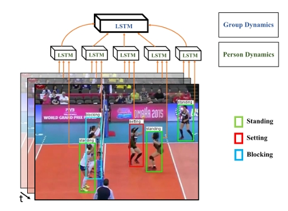
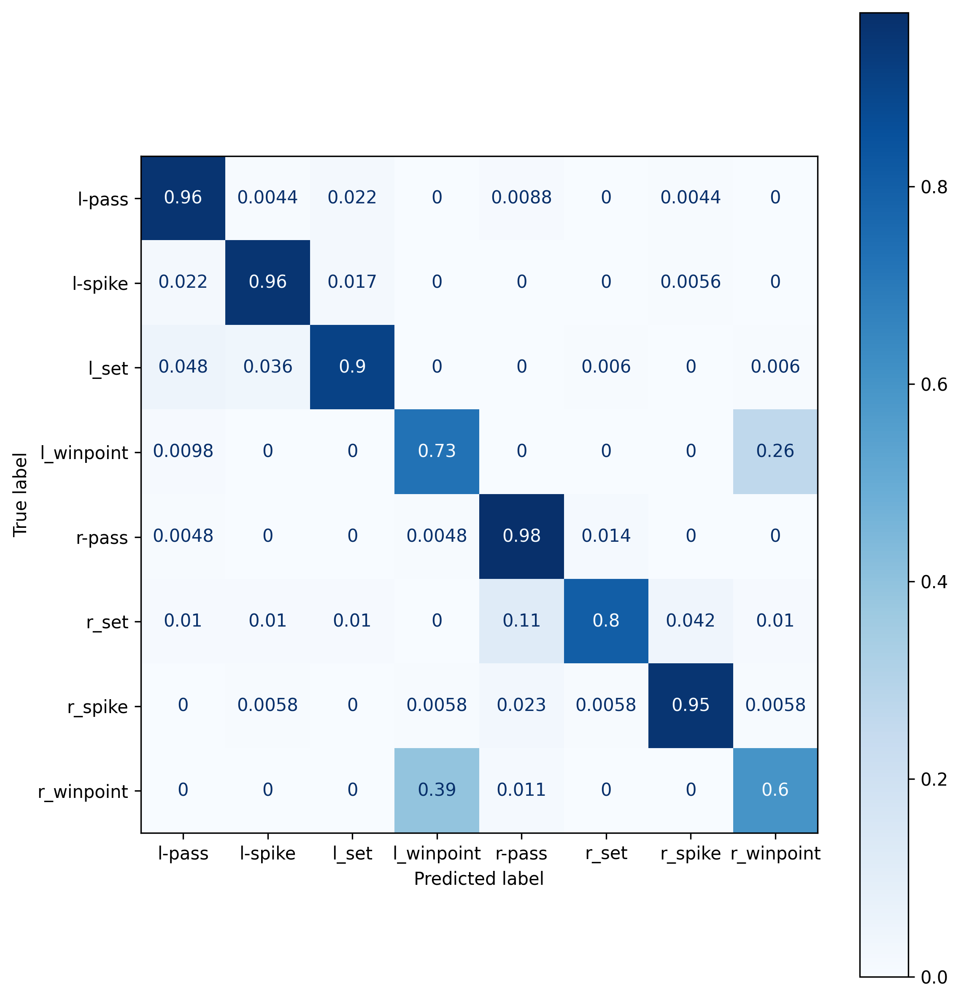

# Hierarchical Deep Temporal Models for Group Activity Recognition

<center>
    
</center>

A PyTorch implementation of "Hierarchical Deep Temporal Models for Group Activity Recognition" (CVPR 2016). This repository reproduces and extends the baselines described in the paper and provides modular, well-documented model providers and training utilities for reproducible experiments.

## Highlights

- Modular baseline implementations (B1–B8) with a clear provider interface.
- Support for person- and group-level models, temporal modeling via LSTMs, and TensorBoard logging.
- Reproducible training procedure with configurable hyperparameters in `helpers.config.Settings`.

## Citation

If you use this repository in your research, please cite the original paper:

> Mostafa S. Ibrahim, Srikanth Muralidharan, Zhiwei Deng, Arash Vahdat, Greg Mori "Hierarchical Deep Temporal Models for Group Activity Recognition", CVPR 2016.

## Requirements

- Python 3.12+
- See `requirements.txt` for exact package versions used for development and evaluation.

## Quickstart

1. Create and activate a Python environment (Miniconda recommended):

```bash
conda create -n activity-recognition python=3.12
conda activate activity-recognition
```

2. Install dependencies:

```bash
pip install -r requirements.txt
```

3. Copy the environment template and set any required variables:

```bash
cp .env.example .env
# edit .env to suit your configuration
```

4. Download the dataset (example via Kaggle):

```bash
kaggle datasets download ahmedmohamed365/volleyball -p ./data --unzip
```

## Usage

- Training is implemented via `controllers.TrainerController`. Instantiate a `TrainerController` with the desired baseline, learning-rate scheduler and DataLoaders, then call `fit()` to execute the training loop and return the best model by validation F1.

- The project stores experiment artifacts and metrics using TensorBoard when `tensorboard_track` is enabled.

```python
import torch
from torch.utils.data import DataLoader
from helpers.config import get_settings
from models.lr.LREnums import LREnums
from models.baselines.providers import PersonModelProvider, B8ModelProvider
from models.baselines.BaselinesEnums import BaselinesEnums
from models.datasets import DatasetProviderFactory, DatasetEnums
from controllers import AnnotationController, TrainerController

# get the configuration set in the `.env` file
settings = get_settings()

# set the seed for reproducibility
torch.manual_seed(settings.SEED)
torch.cuda.manual_seed(settings.SEED)

# process the annotations and get them
annotator = AnnotationController(settings=settings)
annotations = annotator.process_annotations()
# annotator.save_annotations() # you can optionally save them so you can process them only once

# prepare the datasets of the train and val
train_dataset = DatasetProviderFactory(settings=settings, annotations=annotations).create(
    provider=DatasetEnums.DatasetEnums.PERSON,
    videos_split=settings.TRAIN_VIDEOS,
)
val_dataset = DatasetProviderFactory(settings=settings, annotations=annotations).create(
    provider=DatasetEnums.DatasetEnums.PERSON,
    videos_split=settings.VALIDATION_VIDEOS,
)
test_dataset = DatasetProviderFactory(settings=settings, annotations=annotations).create(
    provider=DatasetEnums.DatasetEnums.PERSON,
    videos_split=settings.TEST_VIDEOS,
)


# prepare the train and val loaders
train_loader = DataLoader(
    dataset=train_dataset,
    batch_size=settings.MINI_BATCH,
    shuffle=True,
    pin_memory=bool(settings.PIN_MEMORY),
    num_workers=settings.NUM_WORKERS_TRAIN,
    persistent_workers=bool(settings.PERSISTANT_WORKERS),
    drop_last=True,  # to avoid batch norm errors
)
val_loader = DataLoader(
    dataset=val_dataset,
    batch_size=settings.MINI_BATCH,
    shuffle=False,
    pin_memory=bool(settings.PIN_MEMORY),
    num_workers=settings.NUM_WORKERS_EVAL,
    persistent_workers=bool(settings.PERSISTANT_WORKERS),
    drop_last=True,
)
test_loader = DataLoader(
    dataset=test_dataset,
    batch_size=settings.MINI_BATCH,
    shuffle=False,
    pin_memory=bool(settings.PIN_MEMORY),
    num_workers=settings.NUM_WORKERS_EVAL,
    persistent_workers=bool(settings.PERSISTANT_WORKERS),
    drop_last=True,
)

# setup the base model
base_model = PersonModelProvider(
    settings=settings, 
    resnet_pretrained=True, 
    temporal=True, # B8 expects the base model to be temporal
)

# define our trainer
trainer = TrainerController(
    baseline=BaselinesEnums.B8_MODEL,
    lr_scheduler=LREnums.COSINE,
    settings=settings,
    train_loader=train_loader,
    val_loader=val_loader,
    test_loader=test_loader,
    resnet_pretrained=False,
    base_finetuned=base_model,
    base_freeze=False,
    compile=True,
    group_only=False,
    tensorboard_track=True,
)
```

## Baselines (concise)

All baselines follow the original paper design but employ ResNet-50 as the image backbone (instead of AlexNet), which generally improves feature quality.

- **B1 — Image classification:** Single-frame ResNet-based classifier for group action prediction.
- **B3 — Person-based (frozen):** Uses a fine-tuned person model to extract per-player features; pools features across players to predict group actions (no temporal modeling).
- **B4 — Image + LSTM:** Extracts image-level features per-frame and models temporal dynamics with an LSTM.
- **B5 — Person + LSTM (hierarchical):** Uses a temporal person base to predict player actions and pools player representations to predict group actions.
- **B6 — Two-stage (no LSTM1):** Variant that omits the person-level temporal model; person predictions are derived from the fine-tuned person CNN.
- **B7 — Two-stage (all pooling):** Hierarchical two-stage model with player-level LSTM followed by max-pooling across players and a second LSTM at the clip level.
- **B8 — Final two-stage (paired pooling):** Similar to B7 but pools players into left/right groups (by box ordering) before temporal fusion, reducing confusion between symmetric group actions.

## Results

The table below summarizes representative results (loss / accuracy / F1) obtained with the implemented baselines.

| baseline | loss    | acc      | f1       |
|----------|---------|----------|----------|
| b1       | 1.13796 | 0.7854   | 0.7877   |
| b3       | 0.7185  | 0.7734   | 0.7729   |
| b4       | 0.7837  | 0.7812   | 0.7755   |
| b5       | 0.5079  | 0.81138  | 0.80093  |
| b6       | 0.46214 | 0.836078 | 0.83073  |
| b7       | 0.35916 | 0.88997  | 0.88827  |
| b8       | 0.27161 | 0.925898 | 0.923733 |

Visualizations (confusion matrices) are available in `assets/`:

<div style="text-align: center;">
    <figure style="display: inline-block; margin: 0;">
        
        <figcaption>Confusion matrix for B7 (single-group pooling).</figcaption>
    </figure>
</div>

<br>

<div style="text-align: center;">
    <figure style="display: inline-block; margin: 0;">
        
        <figcaption>Confusion matrix for B8 (paired-group pooling).</figcaption>
    </figure>
</div>


The primary source of confusion in single-group pooling (B7) was between *l_winpoint* and *r_winpoint*, which largely disappears after using paired pooling in B8.

## Demo Video

<!-- A short demonstration video showcasing model predictions and qualitative results can be embedded here. -->

<!-- **Placeholder:** Replace the following with an embedded YouTube or Vimeo link, or a path to a hosted MP4 file. -->

<!-- > Demo video: *Embed demo here (YouTube/Vimeo or local path)* -->

## Contributing

Contributions, issues and feature requests are welcome. Please open an issue or submit a pull request.

## License

This project is released under the terms of the MIT License. See `LICENSE` for details.
